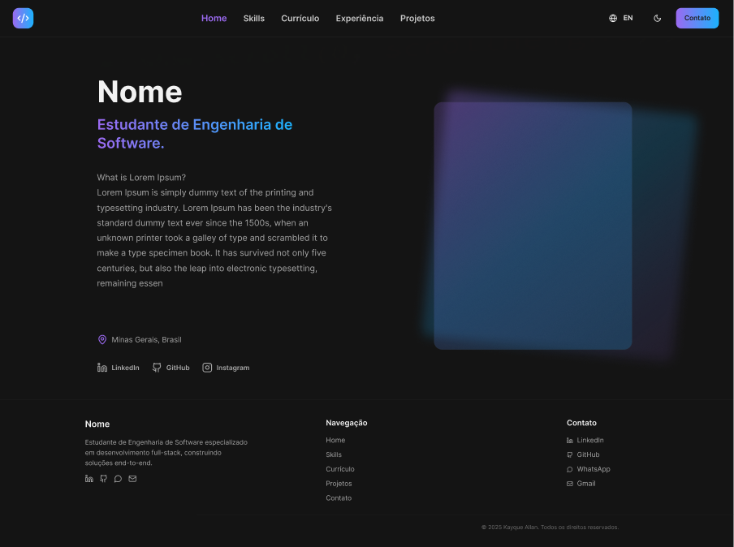
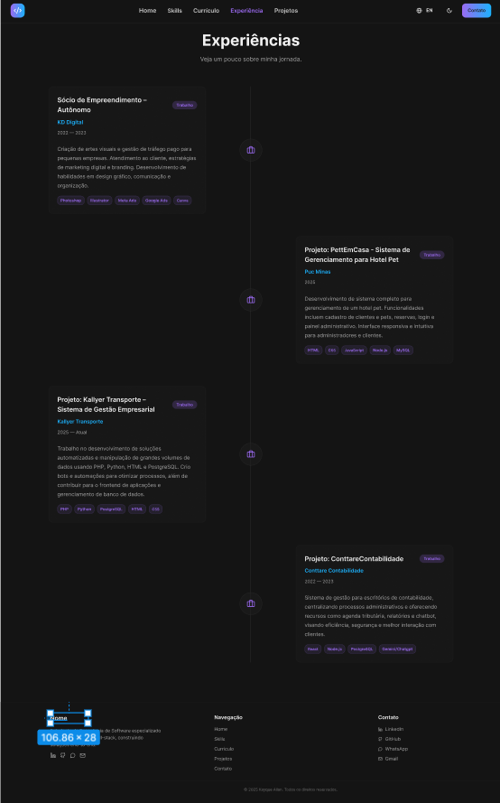
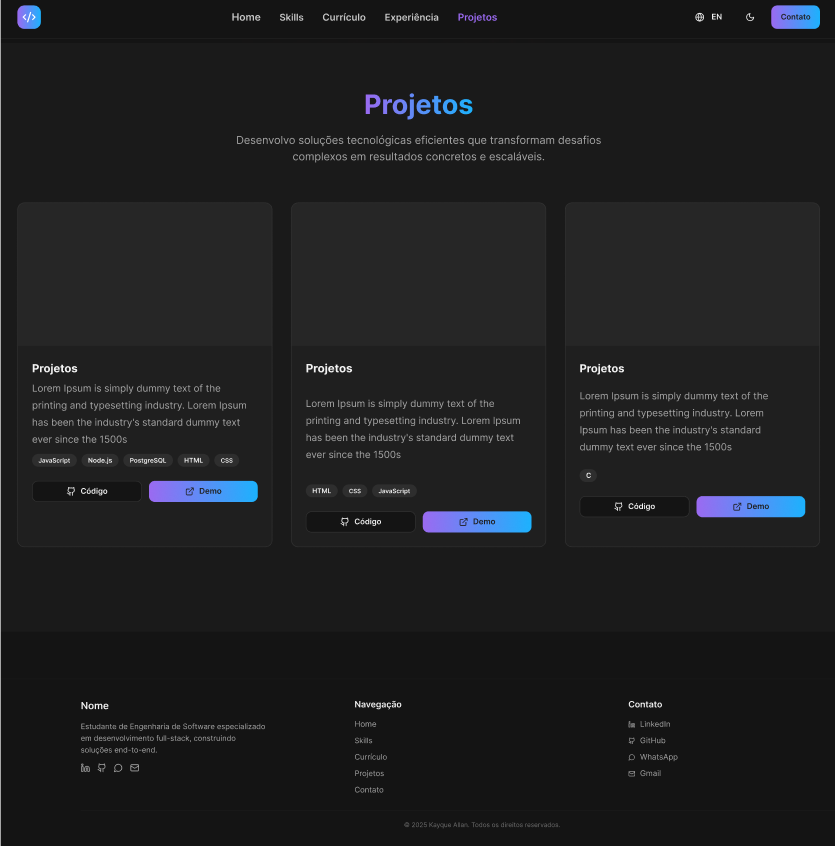
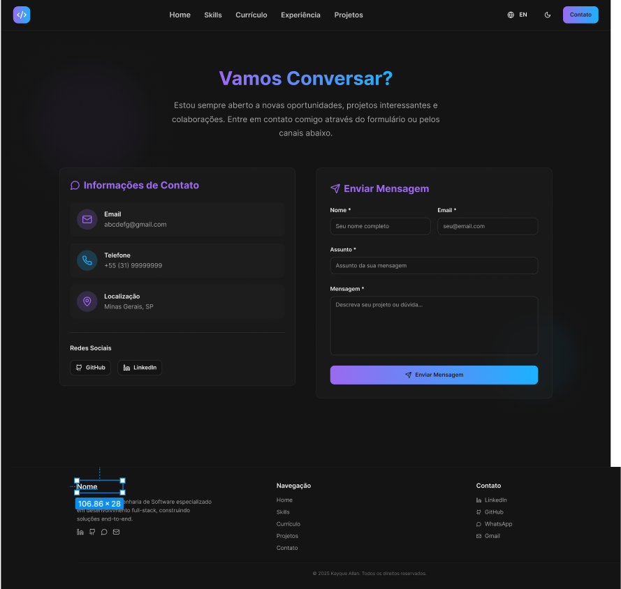

# Kayque Allan - Portfólio

Este é um projeto de portfólio desenvolvido para o Laboratório de Desenvolvimento de Software.

## Tecnologias Utilizadas

Este projeto foi construído com as seguintes tecnologias:

- **Vite**: Um empacotador de módulos e ferramenta de desenvolvimento para projetos web modernos.
- **TypeScript**: Um superconjunto tipado de JavaScript que compila para JavaScript puro.
- **React**: Uma biblioteca JavaScript para construir interfaces de usuário.
- **shadcn-ui**: Uma coleção de componentes de UI reusáveis construídos com Radix UI e Tailwind CSS.
- **Tailwind CSS**: Um framework CSS utilitário para construir designs rapidamente.

## Dependências e Bibliotecas/Frameworks

As principais dependências e bibliotecas/frameworks utilizados neste projeto incluem:

- **React**: Para a construção da interface do usuário.
- **React Router DOM**: Para roteamento de páginas na aplicação.
- **Vite**: Como ferramenta de construção e servidor de desenvolvimento.
- **Tailwind CSS**: Para estilização.
- **shadcn-ui**: Componentes de UI.
- **ESLint**: Para linting de código.
- **PostCSS**: Para transformação de CSS.
- **TypeScript**: Para tipagem estática.

Para uma lista completa, consulte o arquivo `package.json`.

## Estrutura de Diretórios do Projeto

A estrutura de diretórios do projeto está organizada da seguinte forma:

```
portfolio-tiagoba/
  ├── public/                      # Arquivos estáticos (favicon, imagens placeholder, robots.txt)
  ├── src/
  │   ├── assets/                  # Imagens e outros recursos
  │   ├── components/              # Componentes React reutilizáveis (Contact, Experience, Header, etc.)
  │   │   └── ui/                  # Componentes de UI do shadcn-ui
  │   ├── hooks/                   # Hooks personalizados do React
  │   ├── lib/                     # Utilitários e funções auxiliares (utils.ts)
  │   ├── pages/                   # Páginas principais da aplicação (Home, ProjectsPage, ContactPage, etc.)
  │   ├── App.css                  # Estilos globais da aplicação
  │   ├── App.tsx                  # Componente principal da aplicação
  │   ├── index.css                # Estilos CSS de entrada
  │   └── main.tsx                 # Ponto de entrada da aplicação
  ├── .eslintrc.cjs                # Configurações do ESLint
  ├── package.json                 # Metadados e dependências do projeto
  ├── postcss.config.js            # Configurações do PostCSS
  ├── tailwind.config.ts           # Configurações do Tailwind CSS
  ├── tsconfig.json                # Configurações do TypeScript
  ├── vite.config.ts               # Configurações do Vite
  └── README.md                    # Este arquivo README
```

## Instruções de Instalação e Execução Localmente

Para configurar e executar o projeto localmente, siga os passos abaixo:

1.  **Clone o repositório:**

    ```bash
    git clone https://github.com/TiagoBoavAmaral/Portfolio-TiagoBA.git
    cd portfolio-tiagoba
    ```

2.  **Instale as dependências:**

    ```bash
    npm install
    # ou
    yarn install
    # ou
    pnpm install
    # ou
    bun install
    ```

3.  **Execute o servidor de desenvolvimento:**

    ```bash
    npm run dev
    # ou
    yarn dev
    # ou
    pnpm dev
    # ou
    bun dev
    ```

    O aplicativo estará disponível em `http://localhost:8080` (ou outra porta disponível).

4.  **Construa para produção (opcional):**

    ```bash
    npm run build
    # ou
    yarn build
    # ou
    pnpm build
    # ou
    bun build
    ```

    Isso irá gerar os arquivos estáticos na pasta `dist/`.

## Link de Acesso para o Site Publicado na Nuvem

O site está publicado e pode ser acessado através do seguinte link:

[Kayque Allan - Portfólio Online](https://portfolio-tiagoba.vercel.app)

## Wireframes

**Home:**



**Experiências:**



**Projetos:**



**Contatos:**



---
